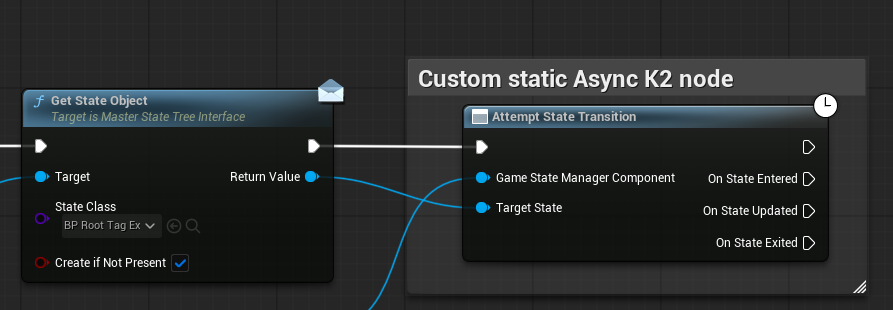

# **UAttemptStateTransitionProxy**

## **Summary**

The `UAttemptStateTransitionProxy` class provides a **Blueprint-friendly, event-driven proxy** to handle state transitions in the `UGameStateManagerComponent`.
It allows developers to **attempt a state transition and react to state lifecycle events** (entered, updated, exited) using Blueprint delegates without manually binding to individual state events.

This is particularly useful for **asynchronous or conditional state management** in gameplay, UI, or experimental simulations.



---

## **Core Features**

* Automatically handles **delegate binding** for a single state transition.
* Broadcasts **OnStateEntered**, **OnStateUpdated**, and **OnStateExited** events.
* Supports **BlueprintCallable** creation through `CreateProxyObjectForAttemptStateTransition`.
* Cleans up delegates automatically when the transition completes or the object is destroyed.

---

## **Functions**

### `CreateProxyObjectForAttemptStateTransition`

```cpp
UFUNCTION(BlueprintCallable, meta = (BlueprintInternalUseOnly = "true"))
static UAttemptStateTransitionProxy* CreateProxyObjectForAttemptStateTransition(
    UGameStateManagerComponent* GameStateManagerComponent,
    UStateObject* TargetState);
```

**Description:**
Creates a proxy object to attempt a state transition. Automatically binds to the state’s lifecycle events and broadcasts them via Blueprint delegates.

**Parameters:**

| Name                        | Type                          | Description                                   |
| --------------------------- | ----------------------------- | --------------------------------------------- |
| `GameStateManagerComponent` | `UGameStateManagerComponent*` | The component managing the root state object. |
| `TargetState`               | `UStateObject*`               | The state to attempt to transition into.      |

**Example (Blueprint):**

```
CreateProxyObjectForAttemptStateTransition(StateManager, TargetState)
    -> Bind OnStateEntered, OnStateUpdated, OnStateExited
```

**Behaviour:**

* Attempts the state transition immediately.
* If successful, binds to the `TargetState` events.
* If unsuccessful, logs a warning and does not bind events.

---

### `OnStateEnteredReceived`

```cpp
UFUNCTION()
void OnStateEnteredReceived();
```

**Description:**
Internal function that triggers the **OnStateEntered** delegate when the state has been successfully entered.

---

### `OnStateUpdatedReceived`

```cpp
UFUNCTION()
void OnStateUpdatedReceived();
```

**Description:**
Internal function that triggers the **OnStateUpdated** delegate whenever the state is updated.

---

### `OnStateExitedReceived`

```cpp
UFUNCTION()
void OnStateExitedReceived();
```

**Description:**
Internal function that triggers the **OnStateExited** delegate and unbinds all previously bound delegates.

---

### `BeginDestroy`

```cpp
virtual void BeginDestroy() override;
```

**Description:**
Cleans up all delegate bindings when the proxy object is destroyed to prevent dangling references.

---

## **Delegates**

| Delegate         | Description                                                   |
| ---------------- | ------------------------------------------------------------- |
| `OnStateEntered` | Triggered when the target state is entered successfully.      |
| `OnStateUpdated` | Triggered every time the target state updates.                |
| `OnStateExited`  | Triggered when the target state exits and cleans up bindings. |

---

## **Usage Summary**

1. Call `CreateProxyObjectForAttemptStateTransition` with a state manager and target state.
2. Bind to the **OnStateEntered**, **OnStateUpdated**, and **OnStateExited** delegates.
3. The proxy will handle the transition and broadcast events automatically.
4. No need to manually unbind events; the proxy does it safely.

